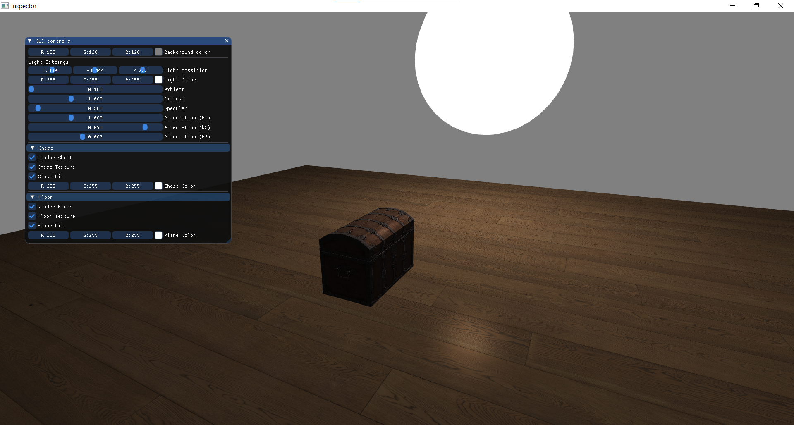
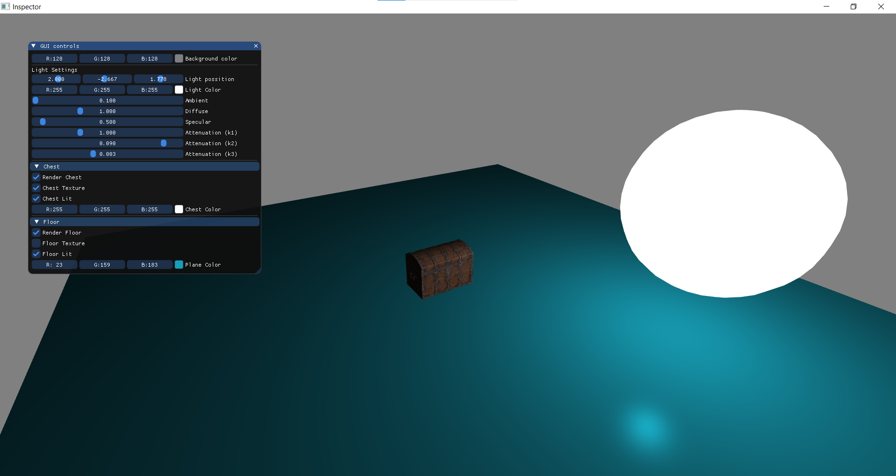

# Inspector OpenGL

An interactive OpenGL scene inspector built with C++, OpenGL 4.1, GLFW, GLEW, GLM and Dear ImGui.

The application renders a simple 3D scene containing a textured floor, a textured treasure chest and a movable light source. Through an ImGui interface the user can modify rendering and lighting parameters in real time.

## Features

- OpenGL 4.1 rendering
- Dear ImGui user interface
- First-person camera controls
- Phong lighting model
- Adjustable ambient lighting
- Adjustable diffuse lighting
- Adjustable specular lighting
- Adjustable attenuation coefficients
- Texture enable/disable controls
- Object visibility controls
- Real-time color editing
- Real-time background color editing

## Screenshot




## Controls

### Camera

| Key | Action |
|------|---------|
| W | Move Forward |
| S | Move Backward |
| A | Move Left |
| D | Move Right |
| Mouse | Look Around |
| Mouse Wheel | Zoom |
| Right Mouse Button | Toggle Cursor |
| ESC | Exit |

## GUI Controls

### Light Settings

- Change light position
- Change light color
- Adjust ambient strength
- Adjust diffuse strength
- Adjust specular strength
- Adjust attenuation coefficients

### Treasure Chest

- Toggle rendering
- Toggle texture
- Toggle lighting
- Change object color

### Floor

- Toggle rendering
- Toggle texture
- Toggle lighting
- Change object color

### Scene

- Change background color

## Technologies

- C++
- OpenGL 4.1
- GLFW
- GLEW
- GLM
- Dear ImGui

## Project Structure

```text
Inspector_OpenGL/
│
├── assets/
├── fragmentShaders/
├── vertexShaders/
├── headerFiles/
├── imgui/
├── inspector.cpp
├── README.md
└── .gitignore
```

## Build Requirements

- Visual Studio 2022
- OpenGL 4.1 compatible GPU
- GLFW
- GLEW
- GLM
- Dear ImGui

## Running

1. Clone the repository

```bash
git clone https://github.com/SokratisPas/Inspector_OpenGL.git
```

2. Open the solution in Visual Studio

3. Build and run